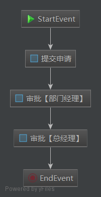

activiti5学习笔记

## 1、工作流

**工作流(Workflow)**，就是“业务过程的部分或整体在计算机应用环境下的自动化”，它主要解决的是“使在多个参与者之间按照某种预定义的规则传递文档、信息或任务的过程自动进行，从而实现某个预期的业务目标，或者促使此目标的实现”。 

**工作流管理系统(Workflow Management System, WfMS)**是一个软件系统，它完成工作量的定义和管理，并按照在系统中预先定义好的工作流规则进行工作流实例的执行。工作流管理系统不是企业的业务系统，而是为企业的业务系统的运行提供了一个软件的支撑环境。 

工作流管理联盟(WfMC，Workflow Management Coalition)给出的关于工作流管理系统的定义是：**工作流管理系统是一个软件系统，它通过执行经过计算的流程定义去支持一批专门设定的业务流程。工作流管理系统被用来定义、管理、和执行工作流程。** 

工作流管理系统的目标：**管理工作的流程以确保工作在正确的时间被期望的人员所执行——在自动化进行的业务过程中插入人工的执行和干预。** 

## 2、Activiti介绍

Activiti5是由Alfresco软件在2010年5月17日发布的业务流程管理（BPM）框架，它是覆盖了业务流程管理、工作流、服务协作等领域的一个开源的、灵活的、易扩展的可执行流程语言框架。Activiti基于Apache许可的开源BPM平台，创始人Tom Baeyens是JBoss jBPM的项目架构师，它特色是提供了eclipse插件，开发人员可以通过插件直接绘画出业务流程图。

### 2.1、工作流引擎

ProcessEngine对象，这是Activiti工作的核心。负责生成流程运行时的各种实例及数据、监控和管理流程的运行。

### 2.2、BPMN

业务流程建模与标注（Business Process Model and Notation，BPMN)，描述流程的基本符号，包括这些图元如何组合成一个业务流程图（Business Process Diagram）

### 2.3、数据库

Activiti数据库支持：

Activiti的后台是有数据库的支持，所有的表都以ACT_开头。 第二部分是表示表的用途的两个字母标识。 用途也和服务的API对应。

ACT_EVT_LOG: 事件日志表

ACT_RE_*: 'RE'表示repository。 这个前缀的表包含了流程定义和流程静态资源 （图片，规则，等等）。

ACT_RU_*: 'RU'表示runtime。 这些运行时的表，包含流程实例，任务，变量，异步任务，等运行中的数据。 Activiti只在流程实例执行过程中保存这些数据， 在流程结束时就会删除这些记录。 这样运行时表可以一直很小速度很快。

ACT_ID_*: 'ID'表示identity。 这些表包含身份信息，比如用户，组等等。

ACT_HI_*: 'HI'表示history。 这些表包含历史数据，比如历史流程实例， 变量，任务等等。

ACT_GE_*: 通用数据， 用于不同场景下，如存放资源文件。

表结构操作：

#### 2.3.1、资源库流程规则表

1) act_re_deployment 部署信息表

2) act_re_model  流程设计模型部署表

3) act_re_procdef  流程定义数据表

#### 2.3.2、运行时数据库表

1) act_ru_execution 运行时流程执行实例表

2) act_ru_identitylink 运行时流程人员表，主要存储任务节点与参与者的相关信息

3) act_ru_task 运行时任务节点表

4) act_ru_variable 运行时流程变量数据表

5) act_ru_event_subscr   监听信息表（几乎用不上）

6) act_ru_job  运行时定时任务数据表（几乎用不上）

#### 2.3.3、历史数据库表

1) act_hi_actinst 历史节点表

2) act_hi_attachment 历史附件表

3) act_hi_comment 历史意见表

4) act_hi_identitylink 历史流程人员表

5) act_hi_detail 历史详情表，提供历史变量的查询

6) act_hi_procinst 历史流程实例表

7) act_hi_taskinst 历史任务实例表

8) act_hi_varinst 历史变量表

#### 2.3.4、组织机构表

1) act_id_group 用户组信息表

2) act_id_info 用户扩展信息表

3) act_id_membership 用户与用户组对应信息表

4) act_id_user 用户信息表

5) act_procdef_info   用户扩展信息表

这四张表很常见，基本的组织机构管理，关于用户认证方面建议还是自己开发一套，组件自带的功能太简单，使用中有很多需求难以满足

#### 2.3.5、通用数据表

1) act_ge_bytearray 二进制数据表

2) act_ge_property 属性数据表存储整个流程引擎级别的数据,初始化表结构时，会默认插入三条记录，

### 2.4、activiti.cfg.xml**（**activiti的配置文件）

Activiti核心配置文件，配置流程引擎创建工具的基本参数和数据库连接池参数。

定义数据库配置参数：

**jdbcUrl**: 数据库的JDBC URL。
**jdbcDriver**: 对应不同数据库类型的驱动。
**jdbcUsername**: 连接数据库的用户名。
**jdbcPassword**: 连接数据库的密码。
基于JDBC参数配置的数据库连接 会使用默认的MyBatis连接池。 下面的参数可以用来配置连接池（来自MyBatis参数）：
**jdbcMaxActiveConnections**: 连接池中处于被使用状态的连接的最大值。默认为10。

**jdbcMaxIdleConnections**: 连接池中处于空闲状态的连接的最大值。

**jdbcMaxCheckoutTime**: 连接被取出使用的最长时间，超过时间会被强制回收。 默认为20000（20秒）。

**jdbcMaxWaitTime**: 这是一个底层配置，让连接池可以在长时间无法获得连接时， 打印一条日志，并重新尝试获取一个连接。（避免因为错误配置导致沉默的操作失败）。 默认为20000（20秒）。
示例数据库配置：


也可以使用javax.sql.DataSource。 （比如，Apache Commons的DBCP）：


### 2.5、logging.properties（日志处理）

日志的配置文件，Activiti操作数据库的时候，整合的日志文件

## 3、准备环境

### 3.1、activiti5软件环境

1) JDK1.6或者更高版本

2) 支持的数据库有：h2, mysql, oracle, postgres, mssql, db2等。

3) 支持activiti5运行的jar包

4) 开发环境为Eclipse3.7或者以上版本,myeclipse为8.6版本

### 3.2、相关资源下载

1) JDK可以到sun的官网下载

http://www.oracle.com/technetwork/java/javase/downloads/index.html

2) 数据库，例如：mysql可以在官网上下载。

[http://www.mysql.com](http://www.mysql.com/)

3) activiti也可以到Activiti官方网站下载得到。

http://activiti.org/download.html

4) Eclipse或者MyEclipse也可以到相应的网站上获得下载。本人用的是IDEA

### 3.3、准备Activiti5开发环境

#### 3.3.1、pom.xml

```xml
<activiti.version>5.22.0</activiti.version>

<!-- 工作流 -->
<dependency>
    <groupId>org.activiti</groupId>
    <artifactId>activiti-spring-boot-starter-basic</artifactId>
    <version>${activiti.version}</version>
</dependency>
```

#### 3.3.2、初始化数据库

```java
@Test
public void createTable() {
    // 1.创建Activiti配置对象实例
    ProcessEngineConfiguration processEngineConfiguration = ProcessEngineConfiguration.createStandaloneProcessEngineConfiguration();
    // 2.设置数据库信息
    processEngineConfiguration.setJdbcUrl("jdbc:mysql://localhost:3306/activiti5?useUnicode=true&characterEncoding=utf-8");
    processEngineConfiguration.setJdbcDriver("com.mysql.jdbc.Driver");
    processEngineConfiguration.setJdbcUsername("root");
    processEngineConfiguration.setJdbcPassword("root123456");
    // 3.设置数据库建表策略
    // DB_SCHEMA_UPDATE_FALSE: 如果不存在表就抛出异常
    // DB_SCHEMA_UPDATE_TRUE: 如果不存在就创建，存在就直接使用
    // DB_SCHEMA_UPDATE_CREATE_DROP: 每次都先删除表，再创建
    processEngineConfiguration.setDatabaseSchemaUpdate(ProcessEngineConfiguration.DB_SCHEMA_UPDATE_TRUE);
    ProcessEngine processEngine = processEngineConfiguration.buildProcessEngine();
    System.err.println(processEngine);
}
```

运行后可以看到数据库中出现了25张表：


 在Activiti中，在创建核心的流程引擎对象时会自动建表。如果程序正常执行，mysql会自动建库，然后创建25张表。

#### 3.3.3、添加并制定配置文件

在Actiiti5中定制流程必定会操作到数据库，如果都像上面那样写一大段代码会非常麻烦，所以我们可以把数据库连接配置写入配置文件。

在Activiti5的官方示例中并没有现成的配置文件，所以先得找到activiti-rest\WEB-INF\classes下有：

##### 3.3.3.1、activiti-context.xml

一个类似spring结构的配置文件，清空内容后改名为activiti.cfg.xml，用来做流程引擎的相关配置。

按照上面代码配置ProcessEngineConfiguration对象，主要定义数据库的连接配置和建表策略，配置文件代码如下：

```xml
<beans xmlns="http://www.springframework.org/schema/beans"
       xmlns:context="http://www.springframework.org/schema/context" xmlns:tx="http://www.springframework.org/schema/tx"
       xmlns:xsi="http://www.w3.org/2001/XMLSchema-instance"
       xsi:schemaLocation="http://www.springframework.org/schema/beans http://www.springframework.org/schema/beans/spring-beans.xsd
http://www.springframework.org/schema/context http://www.springframework.org/schema/context/spring-context-2.5.xsd
http://www.springframework.org/schema/tx http://www.springframework.org/schema/tx/spring-tx-3.0.xsd">

    <!--创建流程引擎对象-->
    <bean id="processEngineConfiguration" class="org.activiti.engine.impl.cfg.StandaloneProcessEngineConfiguration">
        <property name="jdbcDriver" value="com.mysql.jdbc.Driver"/>
        <property name="jdbcUrl" value="jdbc:mysql://localhost:3306/activiti5?useUnicode=true&amp;characterEncoding=utf-8"/>
        <property name="jdbcUsername" value="root"/>
        <property name="jdbcPassword" value="root123456"/>
        <property name="databaseSchemaUpdate" value="true"/>
    </bean>

</beans>
```

Java代码如下：

```java
@Test
public void createTable_2() {
    ProcessEngineConfiguration processEngineConfiguration = ProcessEngineConfiguration.createProcessEngineConfigurationFromResource("activiti.cfg.xml");
    processEngineConfiguration.buildProcessEngine();
}
```

createProcessEngineConfigurationFromResource的参数值为我们添加的配置文件activiti.cfg.xml的名称，执行java代码，流程引擎对象创建成功运行后数据库会自动建表。

##### 3.3.3.2、log4j.properties日志配置文件

把两个文件放入resource目录下即可。

#### 3.3.4、IDEA的activiti插件--actiBPM

IDEA的activiti插件安装网上有很多教程，这里就简单截几张图


安装好了重启IDEA就可以新建bpmn文件了


复制bpmn粘贴到相同目录下，修改文件后缀为xml；右键xml文件导出png文件到相同目录


bpmn转xml时中文乱码解决：

找到IDEA安装目录中bin目录下的这两个文件，在里面都加上`-Dfile.encoding=UTF-8`


## 4、核心API

### 4.1、ProcessEngine

说明：

1) 在Activiti中最核心的类，其他的类都是由他而来。

2) 产生方式：

```java
ProcessEngine processEngine = ProcessEngines.getDefaultProcessEngine();
```

在前面看到了两种创建ProcessEngine（流程引擎）的方式，而这里要简化很多，调用ProcessEngines的getDefaultProceeEngine方法时会自动加载classpath下名为activiti.cfg.xml文件。

3) 可以产生RepositoryService

```java
RepositoryService repositoryService = processEngine.getRepositoryService();
```

4) 可以产生RuntimeService

```java
RuntimeService runtimeService = processEngine.getRuntimeService();
```

5) 可以产生TaskService

```java
TaskService taskService = processEngine.getTaskService();
```

各个Service的作用：

| **RepositoryService** | **管理流程定义**                                 |
| --------------------- | ------------------------------------------------ |
| **RuntimeService**    | **执行管理，包括启动、推进、删除流程实例等操作** |
| **TaskService**       | **任务管理**                                     |
| **HistoryService**    | **历史管理(执行完的数据的管理)**                 |
| **IdentityService**   | **组织机构管理**                                 |
| FormService           | 一个可选服务，任务表单管理                       |
| ManagementService     | Job任务管理                                      |
| DynamicBpmnService    | 直接操作流程定义，而不需要读取模型，再设计部署   |

### 4.2、RepositoryService

是Activiti的仓库服务类。所谓的仓库指流程定义文档的两个文件：bpmn文件和流程图片。

1) 产生方式

```java
RepositoryService repositoryService = processEngine.getRepositoryService();
```

2) 可以产生DeploymentBuilder，用来定义流程部署的相关参数

```java
DeploymentBuilder deployment = repositoryService.createDeployment();
```

3) 删除流程定义

```java
repositoryService.deleteDeployment("deploymentId");
```

### 4.3、RuntimeService

是activiti的流程执行服务类。可以从这个服务类中获取很多关于流程执行相关的信息。

### 4.4、TaskService

是activiti的任务服务类。可以从这个类中获取任务的信息。

### 4.5、HistoryService

是activiti的查询历史信息的类。在一个流程执行完成后，这个对象为我们提供查询历史信息。

### 4.6、ProcessDefinition

流程定义类。可以从这里获得资源文件等。

### 4.7、ProcessInstance

代表流程定义的执行实例。如范冰冰请了一天的假，她就必须发出一个流程实例的申请。一个流程实例包括了所有的运行节点。我们可以利用这个对象来了解当前流程实例的进度等信息。**流程实例就表示一个流程从开始到结束的最大的流程分支**，即一个流程中流程实例只有一个。

### 4.8、Execution

Activiti用这个对象去描述流程执行的每一个节点。在没有并发的情况下，Execution就是同ProcessInstance。流程按照流程定义的规则执行一次的过程，就可以表示执行对象Execution。

ProcessInstance的源代码：

```java
public interface ProcessInstance extends Execution {
```

从源代码中可以看出ProcessInstance就是Execution。但在现实意义上有所区别：


在单线流程中，如上图的贷款流程，ProcessInstance与Execution是一致的。


这个例子有一个特点：wire money(汇钱)和archive(存档)是并发执行的。这个时候，总线路代表ProcessInstance，而分线路中每个活动代表Execution。

**总结：**

**一个流程中，执行对象可以存在多个，但是流程实例只能有一个。**

**当流程按照规则只执行一次的时候，那么流程实例就是执行对象。**

## 5、HelloWorld程序（模拟流程的执行）

### 5.1、流程图



### 5.2、部署流程定义

```java
/**
 * 发布流程
 */
@Test
public void testDeploy() {
    ProcessEngine processEngine = ProcessEngines.getDefaultProcessEngine();
    Deployment deployment = processEngine.getRepositoryService()
        .createDeployment()
        .addClasspathResource("static/Helloworld.bpmn")
        .addClasspathResource("static/Helloworld.png")
        .deploy();
    System.err.println(deployment.getId());
    System.err.println(deployment.getName());
}
```

这里使用RepositoryService部署流程定义

addClasspathResource表示从类路径下加载资源文件，一次只能加载一个文件

### 5.3、启动流程实例

```java
/**
 * 启动流程
 */
@Test
public void testProcess() {
    ProcessEngine processEngine = ProcessEngines.getDefaultProcessEngine();
    ProcessInstance processInstance = processEngine.getRuntimeService()
        // .startProcessInstanceByKey("myProcess_1");// 使用流程定义的key启动流程，系统会默认使用最新版本（version）启动
        .startProcessInstanceById("myProcess_1:1:4");
    System.err.println(processInstance.getId());
}
```

### 5.4、查看我的个人任务

```java
/**
 * 查询个人任务
 */
@Test
public void testTask() {
    ProcessEngine processEngine = ProcessEngines.getDefaultProcessEngine();
    List<Task> taskList = processEngine.getTaskService()
        .createTaskQuery()
        // .taskAssignee("")  执行人
        .list();
    taskList.forEach(System.err::println);
}
```

### 5.5、完成我的个人任务

```java
/**
 * 完成任务
 */
@Test
public void testCompletedTask() {
    ProcessEngine processEngine = ProcessEngines.getDefaultProcessEngine();
    processEngine.getTaskService()
        .complete("7502");
}
```

## 6、管理流程定义

### 6.1、设计流程定义文档

#### 6.1.1、流程图 


#### 6.1.2、bpmn文件

BPMN 2.0根节点是definitions节点。 这个元素中，可以定义多个流程定义（不过我们建议每个文件只包含一个流程定义， 可以简化开发过程中的维护难度）。 一个空的流程定义看起来像下面这样。注意，definitions元素 最少也要包含xmlns 和 targetNamespace的声明。 targetNamespace可以是任意值，它用来对流程实例进行分类。

```xml
<?xml version="1.0" encoding="UTF-8" standalone="yes"?>
<definitions xmlns="http://www.omg.org/spec/BPMN/20100524/MODEL" xmlns:activiti="http://activiti.org/bpmn" xmlns:bpmndi="http://www.omg.org/spec/BPMN/20100524/DI" xmlns:omgdc="http://www.omg.org/spec/DD/20100524/DC" xmlns:omgdi="http://www.omg.org/spec/DD/20100524/DI" xmlns:tns="http://www.activiti.org/test" xmlns:xsd="http://www.w3.org/2001/XMLSchema" xmlns:xsi="http://www.w3.org/2001/XMLSchema-instance" expressionLanguage="http://www.w3.org/1999/XPath" id="m1600045424116" name="" targetNamespace="http://www.activiti.org/test" typeLanguage="http://www.w3.org/2001/XMLSchema">
  <process id="vacation" isClosed="false" isExecutable="true" name="vacation" processType="None">
    <startEvent id="StartEvent" name="Start"/>
    <endEvent id="EndEvent" name="End"/>
    <userTask activiti:assignee="张三" activiti:exclusive="true" id="UserTask1" name="提交假期申请"/>
    <userTask activiti:assignee="李四" activiti:exclusive="true" id="UserTask2" name="审批【部门经理】"/>
    <userTask activiti:assignee="王五" activiti:exclusive="true" id="UserTask3" name="审批【总经理】"/>
    <sequenceFlow id="_7" name="flow1" sourceRef="StartEvent" targetRef="UserTask1"/>
    <sequenceFlow id="_8" name="flow2" sourceRef="UserTask1" targetRef="UserTask2"/>
    <sequenceFlow id="_9" name="flow3" sourceRef="UserTask2" targetRef="UserTask3"/>
    <sequenceFlow id="_10" sourceRef="UserTask3" targetRef="EndEvent"/>
  </process>
  <bpmndi:BPMNDiagram documentation="background=#3C3F41;count=1;horizontalcount=1;orientation=0;width=842.4;height=1195.2;imageableWidth=832.4;imageableHeight=1185.2;imageableX=5.0;imageableY=5.0" id="Diagram-_1" name="New Diagram">
    <bpmndi:BPMNPlane bpmnElement="vacation">
      <bpmndi:BPMNShape bpmnElement="StartEvent" id="Shape-StartEvent">
        <omgdc:Bounds height="32.0" width="32.0" x="250.0" y="35.0"/>
        <bpmndi:BPMNLabel>
          <omgdc:Bounds height="32.0" width="32.0" x="0.0" y="0.0"/>
        </bpmndi:BPMNLabel>
      </bpmndi:BPMNShape>
      <bpmndi:BPMNShape bpmnElement="EndEvent" id="Shape-EndEvent">
        <omgdc:Bounds height="32.0" width="32.0" x="265.0" y="580.0"/>
        <bpmndi:BPMNLabel>
          <omgdc:Bounds height="32.0" width="32.0" x="0.0" y="0.0"/>
        </bpmndi:BPMNLabel>
      </bpmndi:BPMNShape>
      <bpmndi:BPMNShape bpmnElement="UserTask1" id="Shape-UserTask1">
        <omgdc:Bounds height="55.0" width="85.0" x="235.0" y="165.0"/>
        <bpmndi:BPMNLabel>
          <omgdc:Bounds height="55.0" width="85.0" x="0.0" y="0.0"/>
        </bpmndi:BPMNLabel>
      </bpmndi:BPMNShape>
      <bpmndi:BPMNShape bpmnElement="UserTask2" id="Shape-UserTask2">
        <omgdc:Bounds height="55.0" width="85.0" x="240.0" y="305.0"/>
        <bpmndi:BPMNLabel>
          <omgdc:Bounds height="55.0" width="85.0" x="0.0" y="0.0"/>
        </bpmndi:BPMNLabel>
      </bpmndi:BPMNShape>
      <bpmndi:BPMNShape bpmnElement="UserTask3" id="Shape-UserTask3">
        <omgdc:Bounds height="55.0" width="85.0" x="240.0" y="455.0"/>
        <bpmndi:BPMNLabel>
          <omgdc:Bounds height="55.0" width="85.0" x="0.0" y="0.0"/>
        </bpmndi:BPMNLabel>
      </bpmndi:BPMNShape>
      <bpmndi:BPMNEdge bpmnElement="_7" id="BPMNEdge__7" sourceElement="StartEvent" targetElement="UserTask1">
        <omgdi:waypoint x="266.0" y="67.0"/>
        <omgdi:waypoint x="266.0" y="165.0"/>
        <bpmndi:BPMNLabel>
          <omgdc:Bounds height="0.0" width="0.0" x="0.0" y="0.0"/>
        </bpmndi:BPMNLabel>
      </bpmndi:BPMNEdge>
      <bpmndi:BPMNEdge bpmnElement="_8" id="BPMNEdge__8" sourceElement="UserTask1" targetElement="UserTask2">
        <omgdi:waypoint x="280.0" y="220.0"/>
        <omgdi:waypoint x="280.0" y="305.0"/>
        <bpmndi:BPMNLabel>
          <omgdc:Bounds height="0.0" width="0.0" x="0.0" y="0.0"/>
        </bpmndi:BPMNLabel>
      </bpmndi:BPMNEdge>
      <bpmndi:BPMNEdge bpmnElement="_9" id="BPMNEdge__9" sourceElement="UserTask2" targetElement="UserTask3">
        <omgdi:waypoint x="282.5" y="360.0"/>
        <omgdi:waypoint x="282.5" y="455.0"/>
        <bpmndi:BPMNLabel>
          <omgdc:Bounds height="0.0" width="0.0" x="0.0" y="0.0"/>
        </bpmndi:BPMNLabel>
      </bpmndi:BPMNEdge>
      <bpmndi:BPMNEdge bpmnElement="_10" id="BPMNEdge__10" sourceElement="UserTask3" targetElement="EndEvent">
        <omgdi:waypoint x="281.0" y="510.0"/>
        <omgdi:waypoint x="281.0" y="580.0"/>
        <bpmndi:BPMNLabel>
          <omgdc:Bounds height="0.0" width="0.0" x="0.0" y="0.0"/>
        </bpmndi:BPMNLabel>
      </bpmndi:BPMNEdge>
    </bpmndi:BPMNPlane>
  </bpmndi:BPMNDiagram>
</definitions>
```

说明：流程定义文档有两部分组成：

1) bpmn文件

流程规则文件。在部署后，每次系统启动时都会被解析，把内容封装成流程定义放入项目缓存中。Activiti框架结合这个xml文件自动管理流程，流程的执行就是按照bpmn文件定义的规则执行的，bpmn文件是给计算机执行用的。

2) 展示流程图的图片

在系统里需要展示流程的进展图片，图片是给用户看的。

### 6.2、部署流程定义（classpath路径加载文件）

```java
@Test
public void testDeploy() {
    ProcessEngine processEngine = ProcessEngines.getDefaultProcessEngine();
    RepositoryService repositoryService = processEngine.getRepositoryService();
    Deployment deployment = repositoryService.createDeployment()
        .name("请假申请流程")// 添加部署显示名称
        .addClasspathResource("static/Vication.bpmn")// 添加流程定义的规则文件
        .addClasspathResource("static/Vication.png")// 添加流程定义的图片文件
        .deploy();
    System.err.println(deployment.getId());
}
```

说明：

1) 先获取流程引擎对象：在创建时会自动加载classpath下的activiti.cfg.xml

2) 首先获得默认的流程引擎，通过流程引擎获取了一个RepositoryService对象（仓库对象）

3) 由仓库的服务对象产生一个部署对象配置对象，用来封装部署操作的相关配置。

4) 这是一个链式编程，在部署配置对象中设置显示名，上传流程定义规则文件

5) 向数据库表中存放流程定义的规则信息。

6) 这一步在数据库中将操作三张表：

a) **act_re_deployment（部署对象表）**

存放流程定义的显示名和部署时间，每部署一次增加一条记录

b) **act_re_procdef（流程定义表）**

存放流程定义的属性信息，部署每个新的流程定义都会在这张表中增加一条记录。

注意：当流程定义的key相同的情况下，使用的是版本升级

c) **act_ge_bytearray（资源文件表）**

存储流程定义相关的部署信息。即流程定义文档的存放地。每部署一次就会增加两条记录，一条是关于bpmn规则文件的，一条是图片的（如果部署时只指定了bpmn一个文件，activiti会在部署时解析bpmn文件内容自动生成流程图）。两个文件不是很大，都是以二进制形式存储在数据库中。

### 6.3、部署流程定义（zip格式文件）

```java
@Test
public void testDeploy_2() {
    InputStream inputStream = this.getClass().getClassLoader().getResourceAsStream("static/Vacation.zip");
    ZipInputStream zipInputStream = new ZipInputStream(inputStream);
    ProcessEngine processEngine = ProcessEngines.getDefaultProcessEngine();
    Deployment deployment = processEngine.getRepositoryService()
        .createDeployment()
        .name("请假流程")
        .addZipInputStream(zipInputStream)
        .deploy();
    System.err.println(deployment.getId());
}
```

将bpmn文件和png文件压缩成zip格式的文件，使用zip的输入流用作部署流程定义

### 6.4、查看流程定义

查询流程定义的信息

字段：

1. id: {key}:{version}:{随机数}
2. key: 对应流程文件process节点的name属性
3. name: 对应流程文件process节点的id属性
4. version: 发布时自动生成。默认从1开始； 相同key的流程再次发布，version版本在前最高版本上加1.

```java
@Test
public void testProcessDefinition() {
    ProcessEngine processEngine = ProcessEngines.getDefaultProcessEngine();
    List<ProcessDefinition> processDefinitions = processEngine.getRepositoryService()
        .createProcessDefinitionQuery()
        // 添加查询条件
        // .processDefinitionId("")
        // .processDefinitionKey("")
        // .processDefinitionName("")
        // 排序
        .orderByProcessDefinitionId().asc()
        // 结果集
        // .listPage(1, 10);
        .list();
    processDefinitions.forEach(System.err::println);
}
```

结果：

```java
ProcessDefinitionEntity[vacation:1:4]
```

再部署一次运行结果为：

```java
ProcessDefinitionEntity[vacation:2:2504]
ProcessDefinitionEntity[vacation:1:4]
```

可以看到流程定义的key值相同的情况下，版本是从1开始逐次升级的

流程定义的Id是【key：版本：生成ID】

说明：

1) 流程定义和部署对象相关的Service都是RepositoryService。

2) 创建流程定义查询对象，可以在ProcessDefinitionQuery上设置查询的相关参数

3) 调用ProcessDefinitionQuery对象的list方法，执行查询，获得符合条件的流程定义列表

4) 由运行结果可以看出：

Key和Name的值为：bpmn文件process节点的id和name的属性值

```xml
<process id="vacation" isClosed="false" isExecutable="true" name="vacation" processType="None">
```

5) key属性被用来区别不同的流程定义。

6) 带有特定key的流程定义第一次部署时，version为1。之后每次部署都会在当前最高版本号上加1

7) Id的值的生成规则为:{processDefinitionKey}:{processDefinitionVersion}:{generated-id},这里的generated-id是一个自动生成的唯一的数字

8) 重复部署一次，deploymentId的值以一定的形式变化

  规则act_ge_property表生成

### 6.5、删除流程定义

删除部署到activiti中的流程定义。

```java
@Test
public void testDeleteDeploy() {
    ProcessEngine processEngine = ProcessEngines.getDefaultProcessEngine();
    processEngine.getRepositoryService()
        // 普通删除： 只会删除流程部署和定义  如果有正在执行的流程，会抛异常
        // .deleteDeployment("1");
        // 联级删除  会删除跟单签流程相关的所有信息，也包括历史信息
        .deleteDeployment("1", true);
}
```

说明：

1) 因为删除的是流程定义，而流程定义的部署是属于仓库服务的，所以应该先得到RepositoryService

2) 如果该流程定义下没有正在运行的流程，则可以用普通删除。如果是有关联的信息，用级联删除。项目开发中使用级联删除的情况比较多，删除操作一般只开放给超级管理员使用。

### 6.6、获取流程定义文档的资源（查看流程图附件）

查询出流程定义文档。主要查的是图片，用于显示流程用。

```java
@Test
public void testViewImage() throws Exception {
    String deploymentId = "2501";
    ProcessEngine processEngine = ProcessEngines.getDefaultProcessEngine();
    List<String> resourceNames = processEngine.getRepositoryService()
        .getDeploymentResourceNames(deploymentId);
    resourceNames.forEach(resourceName -> {
        System.err.println(resourceName);
        File file = new File("e:/" + resourceName);
        InputStream inputStream = processEngine.getRepositoryService()
            .getResourceAsStream(deploymentId, resourceName);
        try {
            FileOutputStream fileOutputStream = new FileOutputStream(file);
            byte[] bytes = new byte[1024];
            while (inputStream.read(bytes) > 0) {
                fileOutputStream.write(bytes);
            }
            fileOutputStream.flush();
            inputStream.close();
            fileOutputStream.close();
        } catch (Exception e) {

        }
    });
}
```

说明：

1) deploymentId为流程部署ID

2) resourceName为act_ge_bytearray表中NAME_列的值

3) 使用repositoryService的getDeploymentResourceNames方法可以获取指定部署下得所有文件的名称

4) 使用repositoryService的getResourceAsStream方法传入部署ID和资源图片名称可以获取部署下指定名称文件的输入流

### 6.7、总结

**Deployment  部署对象**

1、一次部署的多个文件的信息。对于不需要的流程可以删除和修改。

2、对应的表：

 act_re_deployment：部署对象表

 act_re_procdef：流程定义表

 act_ge_bytearray：资源文件表

 act_ge_property：主键生成策略表

**ProcessDefinition流程定义**

1、解析.bpmn后得到的流程定义规则的信息，工作流系统就是按照流程定义的规则执行的。

## 7、流程实例、任务的执行

### 7.1、流程图


### 7.2、部署流程定义

同 6.2/6.3

### 7.3、启动流程实例

```java
@Test
public void testStartProcess() {
    ProcessEngine processEngine = ProcessEngines.getDefaultProcessEngine();
    ProcessInstance processInstance = processEngine.getRuntimeService()
            // .startProcessInstanceByKey("vacation");   使用流程key启动流程 默认使用最高版本流程
            .startProcessInstanceById("vacation:2:5004");
    System.err.println(processInstance.getId());
    System.err.println(processInstance.getDeploymentId());
    System.err.println(processInstance.getProcessDefinitionId());
    System.err.println(processInstance.getActivityId());
}
```

说明：

1) 操作数据库的act_ru_execution表,如果是用户任务节点，同时也会在act_ru_task添加一条记录

2) 影响表：act_hi_actinst；act_hi_identitylink；act_hi_procinst；act_hi_taskinst；act_ru_execution；act_ru_identitylink；act_ru_task。

### 7.4、查询我的个人任务

```java
@Test
public void testTaskList() {
    String assginee = "张三";
    ProcessEngine processEngine = ProcessEngines.getDefaultProcessEngine();
    List<Task> taskList = processEngine.getTaskService()
        .createTaskQuery()
        .taskAssignee(assginee)// 任务办理人
        .orderByTaskCreateTime().asc() // 任务创建时间正序
        .list();
    taskList.forEach(System.err::println);
}
```

说明：

1) 因为是任务查询，所以从processEngine中应该得到TaskService

2) 使用TaskService获取到任务查询对象TaskQuery

3) 为查询对象添加查询过滤条件，使用taskAssignee指定任务的办理者（即查询指定用户的代办任务），同时可以添加分页排序等过滤条件

4) 调用list方法执行查询，返回办理者为指定用户的任务列表

5) 任务ID、名称、办理人、创建时间可以从act_ru_task表中查到。

6) Execution与ProcessInstance见4.7和4.8章节的介绍。在这种情况下，ProcessInstance相当于Execution

7) 如果assignee属性为部门经理，结果为空。因为现在流程只到了”填写请假申请”阶段，后面的任务还没有执行，即在数据库中没有部门经理可以办理的任务，所以查询不到。

8) 一个Task节点和Execution节点是1对1的情况，在task对象中使用Execution_来表示他们之间的关系

9) 任务ID在数据库表act_ru_task中对应“ID_”列

附加：

在activiti任务中，主要分为两大类查询任务（**个人任务**和组任务）：

1.确切指定了办理者的任务，这个任务将成为指定者的私有任务，即个人任务。

2.无法指定具体的某一个人来办理的任务，可以把任务分配给几个人或者一到 多个小组，让这个范围内的用户可以选择性（如有空余时间时）来办理这类任务，即组任务。

先知道个人任务的查询和办理，组任务的操作后面讲

### 7.5、办理任务

```java
@Test
public void testCompleted() {
    ProcessEngine processEngine = ProcessEngines.getDefaultProcessEngine();
    processEngine.getTaskService()
        .complete("7504");// 任务id
}
```

说明：

1) 是办理任务，所以从ProcessEngine得到的是TaskService。

2) 当执行完这段代码，再以员工的身份去执行查询的时候，会发现这个时候已经没有数据了，因为正在执行的任务中没有数据。

3) 对于执行完的任务，activiti将从act_ru_task表中删除该任务，下一个任务会被插入进来。

4) 以”部门经理”的身份进行查询，可以查到结果。因为流程执行到部门经理审批这个节点了。

5) 再执行办理任务代码，执行完以后以”部门经理”身份进行查询，没有结果。

6) 重复第3和4步直到流程执行完。

### 7.6、查询流程状态（判断流程正在执行，还是结束）

```java
@Test
public void testProcessStatus() {
    ProcessEngine processEngine = ProcessEngines.getDefaultProcessEngine();
    ProcessInstance processInstance = processEngine.getRuntimeService()
        .createProcessInstanceQuery()
        .processDefinitionId("vacation:2:5004")
        .singleResult();
    if (processInstance != null) {
        System.err.println("流程正在执行：" + processInstance.getActivityId());
    } else {
        System.err.println("流程已结束!");
    }
}
```

在流程执行过程中，创建的流程实例ID在整个过程中都不会变，当流程结束后，流程实例将会在正在执行的执行对象表中（act_ru_execution）被删除

说明：

1) 因为是查询流程实例，所以先获取runtimeService

2) 创建流程实例查询对象，设置实例ID过滤参数

3) 由于一个流程实例ID只对应一个实例，使用singleResult执行查询返回一个唯一的结果，如果结果数量大于1，则抛出异常

4) 判断指定ID的实例是否存在，如果结果为空，则代表流程结束，实例在正在执行的执行对象表中已被删除，转换成历史数据。

### 7.7、总结

**Execution  执行对象**

 按流程定义的规则执行一次的过程.

 对应的表：

 act_ru_execution： 正在执行的信息

 act_hi_procinst：已经执行完的历史流程实例信息

 act_hi_actinst：存放历史所有完成的活动

**ProcessInstance  流程实例**

特指流程从开始到结束的那个最大的执行分支，一个执行的流程中，流程实例只有1个。

**注意**

  （1）如果是单例流程，执行对象ID就是流程实例ID

  （2）如果一个流程有分支和聚合，那么执行对象ID和流程实例ID就不相同

  （3）一个流程中，流程实例只有1个，执行对象可以存在多个。

**Task任务**

 执行到某任务环节时生成的任务信息。

 对应的表：

 act_ru_task：正在执行的任务信息

 act_hi_taskinst：已经执行完的历史任务信息

## 8、流程变量

### 8.1、流程图


流程变量在整个工作流中扮演很重要的作用。例如：请假流程中有请假天数、请假原因等一些参数都为流程变量的范围。流程变量的作用域范围是只对应一个流程实例。也就是说各个流程实例的流程变量是不相互影响的。流程实例结束完成以后流程变量还保存在数据库中。

例如：


即：


### 8.2、部署流程定义

```java
    /**
     * 输入流加载资源文件的3种方式
     * this.getClass().getClassLoader().getResourceAsStream("static/Vacation2.bpmn");
     * 从classpath根目录下加载指定文件
     * this.getClass().getResourceAsStream("static/Vacation2.bpmn");
     * 从当前包下加载指定文件
     * this.getClass().getResourceAsStream("/static/Vacation2.bpmn")
     * 从classpath根目录下加载指定文件
     */
    @Test
    public void testDeploy() {
        InputStream inputStream = this.getClass().getResourceAsStream("/static/Vacation2.bpmn");
        InputStream inputStreampng = this.getClass().getResourceAsStream("/static/Vacation2.png");

        ProcessEngine processEngine = ProcessEngines.getDefaultProcessEngine();
        Deployment deployment = processEngine.getRepositoryService()
                .createDeployment()
                .name("请假申请流程")
                // .addClasspathResource("static/Vacation2.bpmn")
                // .addClasspathResource("static/Vacation2.png")
                .addInputStream("static/Vacation2.bpmn", inputStream)
                .addInputStream("static/Vacation2.png", inputStreampng)
                .deploy();
        System.err.println(deployment.getId());
    }
```

### 8.3、启动流程实例

```java
@Test
public void testStartProcess() {
    Map<String, Object> variables = new HashMap<>();
    variables.put("opTenant", "1112");
    ProcessEngine processEngine = ProcessEngines.getDefaultProcessEngine();
    ProcessInstance processInstance = processEngine.getRuntimeService()
        .startProcessInstanceByKey("vacation2", variables);
    System.err.println(processInstance.getProcessDefinitionId());
    System.err.println(processInstance.getActivityId());
    System.err.println(processInstance.getId());
}
```

### 8.4、设置流程变量

```java
@Test
public void testSetVariables() {
    Map<String, Object> variables = new HashMap<>();
    // 相同key值会覆盖
    variables.put("opTenant", "2222");
    variables.put("comment", "申请假期");
    variables.put("days", 5);
    // 必须实现Serializable接口
    Person person = new Person("小明", 12);
    variables.put("with", person);
    ProcessEngine processEngine = ProcessEngines.getDefaultProcessEngine();
    processEngine.getTaskService()
            .complete("27505", variables);
}
```

说明：

1) 流程变量的作用域就是流程实例，所以只要设置就行了，不用管在哪个阶段设置

2) 基本类型设置流程变量，在taskService中使用任务ID，定义流程变量的名称，设置流程变量的值。

3) Javabean类型设置流程变量，需要这个javabean实现了Serializable接口

4) 设置流程变量的时候，向act_ru_variable这个表添加数据

### 8.5、获取流程变量

```java
@Test
public void testGetVariables() {
    String taskId = "30007";
    // ProcessEngine processEngine = ProcessEngines.getDefaultProcessEngine();
    TaskService taskService = processEngine.getTaskService();
    String opTenant = (String) taskService.getVariable(taskId, "opTenant");
    String comment = (String) taskService.getVariable(taskId, "comment");
    Integer days = (Integer) taskService.getVariable(taskId, "days");
    Person with = taskService.getVariable(taskId, "with", Person.class);
    System.err.println("opTenant=" + opTenant);
    System.err.println("comment=" + comment);
    System.err.println("days=" + days);
    System.err.println("with=" + with);
    System.err.println("==============获取多个variables================");
    List<String> variableNames = new ArrayList<>();
    variableNames.add("opTenant");
    variableNames.add("comment");
    variableNames.add("days");
    variableNames.add("with");
    Map<String, Object> variables = taskService.getVariables(taskId, variableNames);
    variables.entrySet().forEach(entry -> System.err.println(entry.getKey() + "=" + entry.getValue()));
}
```

说明：

1） 流程变量的获取针对流程实例（即1个流程），每个流程实例获取的流程变量时不同的

2） 使用基本类型获取流程变量，在taskService中使用任务ID，流程变量的名称，获取流程变量的值。

3） Javabean类型设置获取流程变量，除了需要这个javabean实现了Serializable接口外，还要求流程变量对象的属性不能发生编号，否则抛出异常。

### 8.6、模拟流程变量的设置和获取的场景

1） RuntimeService对象可以设置流程变量和获取流程变量

2） TaskService对象可以设置流程变量和获取流程变量

3） 流程实例启动的时候可以设置流程变量

4） 任务办理完成的时候可以设置流程变量

5） 流程变量可以通过名称/值的形式设置单个流程变量

6） 流程变量可以通过Map集合，同时设置多个流程变量

Map集合的key表示流程变量的名称

Map集合的value表示流程变量的值

### 8.7、查询历史的流程变量

```java
@Test
public void testGetHistoryVariables() {
    HistoryService historyService = processEngine.getHistoryService();
    List<HistoricVariableInstance> list = historyService.createHistoricVariableInstanceQuery()
            .variableName("opTenant")
            .list();
    if (list != null) {
        list.forEach(System.err::println);
    }
}
```

说明：

1）历史的流程变量查询，指定流程变量的名称，查询act_hi_varinst表（也可以针对，流程实例ID，执行对象ID，任务ID查询）

### 8.8、流程变量的支持的类型

如图是从官网列出来的流程变量


从图中可以看出包括了大部分封装类型和Date、String和实现了Serializable接口的类的类型。

### 8.9、总结

• **1：流程变量**

在流程执行或者任务执行的过程中，用于设置和获取变量，使用流程变量在流程传递的过程中传递业务参数。

对应的表：

act_ru_variable：正在执行的流程变量表

act_hi_varinst：流程变量历史表

• **2：扩展知识：setVariable和setVariableLocal的区别**

setVariable：设置流程变量的时候，流程变量名称相同的时候，后一次的值替换前一次的值，而且可以看到TASK_ID的字段不会存放任务ID的值

setVariableLocal：

1：设置流程变量的时候，针对当前活动的节点设置流程变量，如果一个流程中存在2个活动节点，对每个活动节点都设置流程变量，即使流程变量的名称相同，后一次的版本的值也不会替换前一次版本的值，它会使用不同的任务ID作为标识，存放2个流程变量值，而且可以看到TASK_ID的字段会存放任务ID的值

例如act_hi_varinst 表的数据：不同的任务节点，即使流程变量名称相同，存放的值也是不同的。

如图：


2：还有，使用setVariableLocal说明流程变量绑定了当前的任务，当流程继续执行时，下个任务获取不到这个流程变量（因为正在执行的流程变量中没有这个数据），所有查询正在执行的任务时不能查询到我们需要的数据，此时需要查询历史的流程变量。

## 9、流程执行历史记录

### 9.1、查询历史流程实例

查找按照某个流程定义的规则一共执行了多少次流程

```java
/**
 * 查看历史流程实例
 */
@Test
public void testQueryHistoryProcessInstance() {
    HistoryService historyService = processEngine.getHistoryService();
    List<HistoricProcessInstance> historicProcessInstances = historyService.createHistoricProcessInstanceQuery()
            .processDefinitionKey("vacation2")
            .orderByProcessInstanceStartTime().desc()
            .list();
    historicProcessInstances.forEach(historicProcessInstance -> {
        System.err.println("id = " + historicProcessInstance.getId());
        System.err.println("pdid = " + historicProcessInstance.getProcessDefinitionId());
        System.err.println("did" + historicProcessInstance.getDeploymentId());
        System.err.println(historicProcessInstance.getStartTime());
        System.err.println(historicProcessInstance.getEndTime());
        System.err.println("cost" + historicProcessInstance.getDurationInMillis() + "ms");
        System.err.println("==============================");
    });
}
```

### 9.2、查询历史活动

某一次流程的执行一共经历了多少个活动

```java
/**
 * 历史活动查看（某一次流程的执行经过多少步）
 */
@Test
public void testHistoryActivityInstance() {
    List<HistoricActivityInstance> historicActivityInstances = processEngine.getHistoryService()
            .createHistoricActivityInstanceQuery()
            .processInstanceId("27501")
            .orderByHistoricActivityInstanceEndTime().asc()
            .list();
    historicActivityInstances.forEach(historicActivityInstance -> {
        System.err.println("activitiId:" + historicActivityInstance.getActivityId());
        System.err.println("name:" + historicActivityInstance.getActivityName());
        System.err.println("type:" + historicActivityInstance.getActivityType());
        System.err.println("pid:" + historicActivityInstance.getProcessInstanceId());
        System.err.println("assignee:" + historicActivityInstance.getAssignee());
        System.err.println("startTime:" + historicActivityInstance.getStartTime());
        System.err.println("endTime:" + historicActivityInstance.getEndTime());
        System.err.println("duration:" + historicActivityInstance.getDurationInMillis());
        System.err.println("======================================================");
    });
}
```

### 9.3、查询历史任务

某一次流程的执行一共经历了多少个任务

```java
/**
 * 历史任务查看（某一次流程执行经历多少任务节点）
 */
@Test
public void testQueryHistoryTask() {
    List<HistoricTaskInstance> historicTaskInstances = processEngine.getHistoryService()
            .createHistoricTaskInstanceQuery()
            .processInstanceId("27501")
            .orderByHistoricTaskInstanceEndTime().asc()
            .list();
    historicTaskInstances.forEach(historicTaskInstance -> {
        System.err.println("taskId:" + historicTaskInstance.getId());
        System.err.println("name:" + historicTaskInstance.getName());
        System.err.println("assignee:" + historicTaskInstance.getAssignee());
        System.err.println("pdid:" + historicTaskInstance.getProcessDefinitionId());
        System.err.println("piid:" + historicTaskInstance.getProcessInstanceId());
        System.err.println("startTime:" + historicTaskInstance.getStartTime());
        System.err.println("endTime:" + historicTaskInstance.getEndTime());
        System.err.println("duration:" + historicTaskInstance.getDurationInMillis());
        System.err.println("=======================================================");
    });
}
```

### 9.4、查询历史流程变量

某一次流程的执行一共设置的流程变量

```java
/**
 * 某一次流程执行中设置的流程变量
 */
@Test
public void testHistoryVariables() {
    List<HistoricVariableInstance> historicVariableInstances = processEngine.getHistoryService()
            .createHistoricVariableInstanceQuery()
            .processInstanceId("27501")
            .list();
    historicVariableInstances.forEach(historicVariableInstance -> {
        System.err.println("piid:" + historicVariableInstance.getProcessInstanceId());
        System.err.println("name:" + historicVariableInstance.getVariableName());
        System.err.println("value:" + historicVariableInstance.getValue());
        System.err.println("taskId:" + historicVariableInstance.getTaskId());
        System.err.println("type:" + historicVariableInstance.getVariableTypeName());
        System.err.println("=======================================");
    });
}
```

### 9.5、总结

由于数据库中保存着历史信息以及正在运行的流程实例信息，在实际项目中对已完成任务的查看频率远不及对代办和可接任务的查看，所以**在activiti采用分开管理，把正在运行的交给RuntimeService、TaskService管理，而历史数据交给HistoryService来管理**。

这样做的好处在于，加快流程执行的速度，因为正在执行的流程的表中数据不会很大。

## 10、连线

### 10.1、流程图


```xml
<process id="Vacation" name="请假申请" isExecutable="true">
    <startEvent id="StartEvent" name="Start"></startEvent>
    <userTask id="UserTask3" name="审批【总经理】"></userTask>
    <endEvent id="EndEvent" name="End"></endEvent>
    <userTask id="UserTask1" name="员工请假"></userTask>
    <userTask id="UserTask2" name="审批【部门经理】"></userTask>
    <sequenceFlow id="flow1" name="to 员工请假" sourceRef="StartEvent" targetRef="UserTask1"></sequenceFlow>
    <sequenceFlow id="flow2" name="to 审批【部门经理】" sourceRef="UserTask1" targetRef="UserTask2"></sequenceFlow>
    <sequenceFlow id="flow3" name="to 审批【总经理】" sourceRef="UserTask2" targetRef="UserTask3">
      <conditionExpression xsi:type="tFormalExpression"><![CDATA[${message=='重要'}]]></conditionExpression>
    </sequenceFlow>
    <sequenceFlow id="flow4" name="to End" sourceRef="UserTask2" targetRef="EndEvent">
      <conditionExpression xsi:type="tFormalExpression"><![CDATA[${message=='不重要'}]]></conditionExpression>
    </sequenceFlow>
    <sequenceFlow id="flow5" name="to End" sourceRef="UserTask3" targetRef="EndEvent"></sequenceFlow>
  </process>
```


### 10.2、部署流程定义+启动流程实例

```java
/**
 * 根据设计器生成的model部署流程
 * @throws Exception
 */
@Test
public void testDeployByModel() throws Exception {
    RepositoryService repositoryService = processEngine.getRepositoryService();
    String modelId = "70001";
    Model model = repositoryService.getModel(modelId);
    byte[] source = repositoryService.getModelEditorSource(model.getId());
    if (source == null) {
        System.err.println("model：" + modelId + "不存在");
        return;
    }
    JsonNode jsonNode = new ObjectMapper().readTree(source);
    BpmnModel bpmnModel = new BpmnJsonConverter().convertToBpmnModel(jsonNode);

    String processName = model.getName()+".bpmn";
    byte[] bytes = new BpmnXMLConverter().convertToXML(bpmnModel);
    // 部署流程
    Deployment deployment = repositoryService
            .createDeployment().name(model.getName())
            .addString(processName, new String(bytes,"UTF-8"))
            .deploy();
    System.err.println(deployment.getId());
}

/**
 * 启动流程
 */
@Test
public void testStartProcess() {
    ProcessInstance vacation = processEngine.getRuntimeService()
            .startProcessInstanceByKey("Vacation");
    System.err.println(vacation.getId());
    System.err.println(vacation.getProcessDefinitionId());
    System.err.println(vacation.getName());
    System.err.println(vacation.getDeploymentId());
}
```

### 10.3、完成任务

```java
/**
 * 完成任务
 */
@Test
public void testCompleted() {
    String taskId = "90003";
    Map<String, Object> variables = new HashMap<>();
    variables.put("message", "不重要");
    processEngine.getTaskService()
            .complete(taskId, variables);
}
```

说明：

1）使用流程变量，设置连线需要的流程变量的名称message，并设置流程变量的值

对应：

```xml
<conditionExpression xsi:type="tFormalExpression"><![CDATA[${message=='重要'}]]></conditionExpression>
```

### 10.4、总结

1、一个活动中可以指定一个或多个SequenceFlow（Start中有一个，End中没有）。

 \* 开始活动中有一个SequenceFlow 。

 \* 结束活动中没有SequenceFlow 。

 \* 其他活动中有1条或多条SequenceFlow

2、如果只有一个，则可以不使用流程变量设置codition的名称；

如果有多个，则需要使用流程变量设置codition的名称。message表示流程变量的名称，‘不重要’表示流程变量的值，${}（或者#{}）中间的内容要使用boolean类型的表达式，用来判断应该执行的连线。

## 11、排他网关（ExclusiveGateWay）

### 11.1、流程图


```xml
<process id="ExclusiveProcess" name="费用报销申请" isExecutable="true">
  <startEvent id="StartEvent" name="Start"></startEvent>
  <userTask id="UserTask1" name="费用报销申请"></userTask>
  <exclusiveGateway id="ExclusiveGateWay" default="gateWay1"></exclusiveGateway>
  <userTask id="UserTask3" name="审批【部门经理】"></userTask>
  <userTask id="UserTask2" name="财务"></userTask>
  <endEvent id="sid-2CFE87EB-0C94-46A7-8A98-0D81071FAFF2"></endEvent>
  <sequenceFlow id="sid-5F97DD79-0854-4E00-AF2C-D82858BABA88" sourceRef="UserTask1" targetRef="ExclusiveGateWay"></sequenceFlow>
  <sequenceFlow id="sid-52C15A3C-9E0B-49A4-800E-31DA48A4847E" sourceRef="UserTask2" targetRef="sid-2CFE87EB-0C94-46A7-8A98-0D81071FAFF2"></sequenceFlow>
  <sequenceFlow id="sid-281BBF04-0D35-4074-B57D-208A936B0879" sourceRef="UserTask3" targetRef="sid-2CFE87EB-0C94-46A7-8A98-0D81071FAFF2"></sequenceFlow>
  <userTask id="UserTask4" name="审批【总经理】"></userTask>
  <sequenceFlow id="sid-D34DF86E-D874-419E-9DB3-43E352D45AD5" sourceRef="UserTask4" targetRef="sid-2CFE87EB-0C94-46A7-8A98-0D81071FAFF2"></sequenceFlow>
  <sequenceFlow id="flow1" sourceRef="StartEvent" targetRef="UserTask1"></sequenceFlow>
  <sequenceFlow id="gateWay2" name="费用大于500小于1000" sourceRef="ExclusiveGateWay" targetRef="UserTask3">
    <conditionExpression xsi:type="tFormalExpression"><![CDATA[${money >= 500 && money <= 1000}]]></conditionExpression>
  </sequenceFlow>
  <sequenceFlow id="gateWay3" name="费用大于1000" sourceRef="ExclusiveGateWay" targetRef="UserTask4">
    <conditionExpression xsi:type="tFormalExpression"><![CDATA[${money > 1000}]]></conditionExpression>
  </sequenceFlow>
  <sequenceFlow id="gateWay1" name="默认执行财务；小于500" sourceRef="ExclusiveGateWay" targetRef="UserTask2"></sequenceFlow>
</process>
```

### 11.2、部署流程定义+启动流程实例

```java
/**
 * 根据设计器生成的model部署流程
 * @throws Exception
 */
@Test
public void testDeployByModel() throws Exception {
    RepositoryService repositoryService = processEngine.getRepositoryService();
    String modelId = "72502";
    Model model = repositoryService.getModel(modelId);
    byte[] source = repositoryService.getModelEditorSource(model.getId());
    if (source == null) {
        System.err.println("model：" + modelId + "不存在");
        return;
    }
    JsonNode jsonNode = new ObjectMapper().readTree(source);
    BpmnModel bpmnModel = new BpmnJsonConverter().convertToBpmnModel(jsonNode);

    String processName = model.getName()+".bpmn";
    byte[] bytes = new BpmnXMLConverter().convertToXML(bpmnModel);
    // 部署流程
    Deployment deployment = repositoryService
            .createDeployment().name(model.getName())
            .addString(processName, new String(bytes,"UTF-8"))
            .deploy();
    System.err.println(deployment.getId());
}

/**
 * 启动流程
 */
@Test
public void testStartProcess() {
    ProcessInstance vacation = processEngine.getRuntimeService()
            .startProcessInstanceByKey("ExclusiveProcess");
    System.err.println(vacation.getId());
    System.err.println(vacation.getProcessDefinitionId());
    System.err.println(vacation.getName());
    System.err.println(vacation.getDeploymentId());
}
```

### 11.3、完成我的个人任务

```java
/**
 * 完成任务
 */
@Test
public void testCompleted() {
    String taskId = "130004";
    Map<String, Object> variables = new HashMap<>();
    // variables.put("money", 100);  默认走财务
    variables.put("money", 600); // 走部门经理
    // variables.put("money", 2000); // 走总经理
    processEngine.getTaskService()
            .complete(taskId, variables);
}
```

说明：

1) 一个排他网关对应一个以上的顺序流

2) 由排他网关流出的顺序流都有个conditionExpression元素，在内部维护返回boolean类型的决策结果。

3) 决策网关只会返回一条结果。**当流程执行到排他网关时，流程引擎会自动检索网关出口，从上到下检索如果发现第一条决策结果为true或者没有设置条件的(默认为成立)，则流出。**

PS：我在这个地方吃了个亏，做好流程图后，测试完成任务时，设置的流程变量money=600，但是走到了默认财务那一步，后来看了下xml里面的sequenceFlow顺序，发现默认的决策在最前面，按照上面的规则，直接就流出到财务那里了。 - - 

4) 如果没有任何一个出口符合条件，则抛出异常

5) 使用流程变量，设置连线的条件，并按照连线的条件执行工作流，如果没有条件符合的条件，则以默认的连线离开。

## 12、并行网关(parallelGateWay)

### 12.1、流程图

```xml
<process id="ParallelGateWay" name="ParallelProcess" isExecutable="true">
  <startEvent id="StartEvent" name="Start"></startEvent>
  <parallelGateway id="ParallelGateWay1" name="ParallelGateWay1"></parallelGateway>
  <userTask id="UserTask1" name="发货"></userTask>
  <userTask id="UserTask3" name="付款"></userTask>
  <userTask id="UserTask2" name="收货"></userTask>
  <userTask id="UserTask4" name="收款"></userTask>
  <parallelGateway id="ParallelGateWay2" name="parallelGateWay2"></parallelGateway>
  <endEvent id="EndEvent" name="End"></endEvent>
  <sequenceFlow id="sid-44D34518-29F3-4911-98D1-0043A5D31E8C" sourceRef="StartEvent" targetRef="ParallelGateWay1"></sequenceFlow>
  <sequenceFlow id="sid-A1C69182-9710-4C7A-A63E-5E2E6D8642A6" sourceRef="ParallelGateWay1" targetRef="UserTask1"></sequenceFlow>
  <sequenceFlow id="sid-893CFBED-AAC6-45B7-B122-99E683764BFF" sourceRef="ParallelGateWay1" targetRef="UserTask3"></sequenceFlow>
  <sequenceFlow id="sid-21CC75D6-EBE4-4079-8012-AAA2EF8D25EE" sourceRef="UserTask1" targetRef="UserTask2"></sequenceFlow>
  <sequenceFlow id="sid-2C58D40C-323E-42D5-90FE-B76332B1F5AA" sourceRef="UserTask3" targetRef="UserTask4"></sequenceFlow>
  <sequenceFlow id="sid-F4E48FF9-837F-4A9D-9AEF-718EE9597CEB" sourceRef="UserTask2" targetRef="ParallelGateWay2"></sequenceFlow>
  <sequenceFlow id="sid-17C16F8A-307F-4EDF-883B-1DDB27BB1044" sourceRef="UserTask4" targetRef="ParallelGateWay2"></sequenceFlow>
  <sequenceFlow id="sid-1B8231DD-26C5-4D53-8EEA-9FC04DD30817" sourceRef="ParallelGateWay2" targetRef="EndEvent"></sequenceFlow>
</process>
```

### 12.2、部署流程定义+启动流程实例

```java
/**
 * 根据设计器生成的model部署流程
 * @throws Exception
 */
@Test
public void testDeployByModel() throws Exception {
    RepositoryService repositoryService = processEngine.getRepositoryService();
    String modelId = "72505";
    Model model = repositoryService.getModel(modelId);
    byte[] source = repositoryService.getModelEditorSource(model.getId());
    if (source == null) {
        System.err.println("model：" + modelId + "不存在");
        return;
    }
    JsonNode jsonNode = new ObjectMapper().readTree(source);
    BpmnModel bpmnModel = new BpmnJsonConverter().convertToBpmnModel(jsonNode);

    String processName = model.getName()+".bpmn";
    byte[] bytes = new BpmnXMLConverter().convertToXML(bpmnModel);
    // 部署流程
    Deployment deployment = repositoryService
            .createDeployment().name(model.getName())
            .addString(processName, new String(bytes,"UTF-8"))
            .deploy();
    System.err.println(deployment.getId());
}

/**
 * 启动流程
 */
@Test
public void testStartProcess() {
    ProcessInstance vacation = processEngine.getRuntimeService()
            .startProcessInstanceByKey("ParallelGateWay");
    System.err.println(vacation.getId());
    System.err.println(vacation.getProcessDefinitionId());
    System.err.println(vacation.getName());
    System.err.println(vacation.getDeploymentId());
}
```

### 12.3、完成我的个人任务

```java
/**
 * 完成任务
 */
@Test
public void testCompleted() {
    String taskId = "145002";
    processEngine.getTaskService()
            .complete(taskId);
}
```

说明：

1） 一个流程中流程实例只有1个，执行对象有多个

2） 并行网关的功能是基于进入和外出的顺序流的：

**分支(fork)**：并行后的所有外出顺序流，为每个顺序流都创建一个并发分支。

**汇聚(join)**：所有到达并行网关，在此等待的进入分支，直到所有进入顺序流的分支都到达以后，流程就会通过汇聚网关。

3） 并行网关的进入和外出都是使用相同节点标识

4） 如果同一个并行网关有多个进入和多个外出顺序流， 它就同时具有分支和汇聚功能。 这时，网关会先汇聚所有进入的顺序流，然后再切分成多个并行分支。

5） 并行网关不会解析条件。即使顺序流中定义了条件，也会被忽略。

6）并行网关不需要是“平衡的”（比如， 对应并行网关的进入和外出节点数目不一定相等）。如图中标示是合法的：


## 13、开始活动节点

（这节没啥东西，我就删掉了，想看的可以到原文中去看看）

1）：结束节点没有出口

2）：其他节点有一个或多个出口。

如果有一个出口，则代表是一个**单线流程**；

如果有多个出口，则代表是开启**并发流程**。

## 14、接收活动（receiveTask，即等待活动）

接收任务是一个简单任务，它会等待对应消息的到达。 当前，官方只实现了这个任务的java语义。 当流程达到接收任务，流程状态会保存到数据库中。

在任务创建后，意味着**流程会进入等待状态**，直到引擎接收了一个**特定的消息**，这会触发流程穿过接收任务继续执行。

ReceiceTask任务，机器自动完成的任务，只会在act_ru_execution表中产生一条数据。

### 14.1、流程图


```xml
  <process id="receiveTask" name="接受活动" isExecutable="true">
    <startEvent id="StartEvent" name="Start"></startEvent>
    <receiveTask id="receiveTask1" name="汇总当天销售额"></receiveTask>
    <receiveTask id="receiveTask2" name="向老板发送短信"></receiveTask>
    <endEvent id="EndEvent" name="End"></endEvent>
    <sequenceFlow id="flow1" sourceRef="StartEvent" targetRef="receiveTask1"></sequenceFlow>
    <sequenceFlow id="flow2" sourceRef="receiveTask1" targetRef="receiveTask2"></sequenceFlow>
    <sequenceFlow id="flow3" sourceRef="receiveTask2" targetRef="EndEvent"></sequenceFlow>
  </process>
```

### 14.2、部署流程定义+启动流程实例

```java
@Test
public void testStartProcess() {
    ProcessInstance processInstance = processEngine.getRuntimeService()
            .startProcessInstanceByKey("receiveTask");
    System.err.println(processInstance.getId());
}

@Test
public void testReceiveTask() {
    RuntimeService runtimeService = processEngine.getRuntimeService();
    String pid = "172501";
    Execution execution = runtimeService
            .createExecutionQuery()
            .processInstanceId(pid)
            .singleResult();
    System.err.println(execution.getId());
    System.err.println(execution.getActivityId());


    Map<String, Object> var1 = new HashMap<>();
    var1.put("money", 10000);
    runtimeService.signal(execution.getId(), var1);
    System.err.println("当天销售额汇总完成");

    Execution execution1 = runtimeService.createExecutionQuery()
            .processInstanceId(pid)
            .singleResult();
    System.err.println(execution1.getId());
    System.err.println(execution1.getActivityId());

    Integer money = (Integer) runtimeService.getVariable(execution1.getId(), "money");
    System.err.println("老板，今天赚了" + money);

    Map<String, Object> var2 = new HashMap<>();
    var2.put("Text Boss", true);
    runtimeService.signal(execution1.getId(), var2);
    System.err.println("向老板发送短信完成");

    ProcessInstance processInstance = runtimeService.createProcessInstanceQuery()
            .processInstanceId(pid)
            .singleResult();
    if (processInstance == null) {
        System.err.println("流程正常结束");
    }
}
```

说明：

1） 当前任务（一般指机器自动完成，但需要耗费一定时间的工作）完成后，向后推移流程，可以调用runtimeService.signal(executionId)，传递接收执行对象的id。

## 15、用户任务（userTask，即用户操作的任务）

### 15.1、个人任务

#### 15.1.1、流程图


#### 15.1.2、分配个人任务方式一（直接指定办理人）

1：流程图中任务节点的配置

```xml
<userTask id="UserTask" name="审批" activiti:assignee="王总"></userTask>
```

2：测试代码：

```
@Test
public void testUserTask1() {
    // 流程启动
    ProcessInstance userTaskTest1 = runtimeService
            .startProcessInstanceByKey("UserTaskTest");
    System.err.println(userTaskTest1.getId());

    // 查看个人任务
    String assignee = "王总";
    List<Task> taskList = taskService
            .createTaskQuery()
            .processInstanceId(userTaskTest1.getId())
            .taskAssignee(assignee)
            .list();

    taskList.forEach(task -> {
        System.err.println("任务" + task.getId() + "执行人:" + task.getAssignee());
        // 完成任务
        taskService.complete(task.getId());
        System.err.println("任务" + task.getId() + "完成");
    });

}
```

说明：

1） 王总是个人任务的办理人

2） 但是这样分配任务的办理人不够灵活，因为项目开发中任务的办理人不要放置XML文件中。

#### 15.1.3、分配个人任务方式二（使用流程变量）

1：流程图中任务节点的配置

```xml
<userTask id="UserTask" name="审批" activiti:assignee="#{userId}"></userTask>
```

2：测试代码

```java
@Test
public void testUserTask2() {
    // 流程启动
    String assignee = "王总";
    Map<String, Object> var = new HashMap<>();
    var.put("userId", assignee);
    ProcessInstance userTaskTest2 = runtimeService
            .startProcessInstanceByKey("UserTaskTest", var);
    System.err.println(userTaskTest2.getId());

    // 查看个人任务
    List<Task> taskList = taskService
            .createTaskQuery()
            .taskAssignee(assignee)
            .list();

    taskList.forEach(task -> {
        System.err.println("任务" + task.getId() + "执行人:" + task.getAssignee());
        // 完成任务
        taskService.complete(task.getId());
        System.err.println("任务" + task.getId() + "完成");
    });
}
```

说明：

1） 王总是个人任务的办理人

2） 在开发中，可以在页面中指定下一个任务的办理人，通过流程变量设置下一个任务的办理人

#### 15.1.4、分配个人任务方式三（使用类）

1：流程图中任务节点的配置

```xml
<userTask id="UserTask" name="审批">
  <extensionElements>
    <activiti:taskListener event="create" class="com.example.actidemo.listener.UserTask3Listener"></activiti:taskListener>
  </extensionElements>
</userTask>
```

2：TaskListenerImpl类，用来设置任务的办理人

```java
package com.example.actidemo.listener;

import org.activiti.engine.delegate.DelegateTask;
import org.activiti.engine.delegate.TaskListener;

/**
 * @author hujt49
 * @Description
 * @create 2020-09-21 11:18
 */
public class UserTask3Listener implements TaskListener {
    private static final long serialVersionUID = -4617807354339318473L;

    @Override
    public void notify(DelegateTask delegateTask) {
        String assignee = "王总";
        delegateTask.setAssignee(assignee);
    }
}
```

3：测试代码

```java
@Test
public void testUserTask3() {
    // 流程启动
    ProcessInstance userTaskTest3 = runtimeService
            .startProcessInstanceByKey("UserTaskTest");
    System.err.println(userTaskTest3.getId());

    // 查看个人任务
    String assignee = "王总";
    List<Task> taskList = taskService
            .createTaskQuery()
            .taskAssignee(assignee)
            .list();

    taskList.forEach(task -> {
        System.err.println("任务" + task.getId() + "执行人:" + task.getAssignee());
        // 可以分配个人任务从一个人到另一个人（认领任务）
        // taskService.setAssignee(task.getId(), "张总");
        // 完成任务
        taskService.complete(task.getId());
        System.err.println("任务" + task.getId() + "完成");
    });
}
```

说明：

1） 在类中使用delegateTask.setAssignee(assignee);的方式分配个人任务的办理人，此时张无忌是下一个任务的办理人

2） 通过processEngine.getTaskService().setAssignee(taskId, userId);将个人任务从一个人分配给另一个人，此时张无忌不再是下一个任务的办理人，而换成了周芷若

3） 在开发中，可以将每一个任务的办理人规定好，例如张三的领导是李四，李四的领导是王五，这样张三提交任务，就可以查询出张三的领导是李四，通过类的方式设置下一个任务的办理人

#### 15.1.5、总结

**个人任务及三种分配方式：**

  1：在taskProcess.bpmn中直接写 assignee=“王总"

  2：在taskProcess.bpmn中写 assignee=“#{userID}”，变量的值要是String的。

​     使用流程变量指定办理人

  3，使用TaskListener接口，要使类实现该接口，在类中定义：

​     delegateTask.setAssignee(assignee);// 指定个人任务的办理人

 **使用任务ID和办理人重新指定办理人：**

   processEngine.getTaskService()

​              .setAssignee(taskId, userId);

### 15.2、组任务

#### 15.2.1、流程图


#### 15.2.2、分配组任务方式一（直接指定办理人）

1：流程图中任务节点的配置

```xml
<userTask id="UserTask" name="审批" activiti:candidateUsers="王总,李总,张总"></userTask>
```

2：测试代码：

```java
@Test
public void testGroupTask1() {
    // 流程启动
    ProcessInstance userTaskTest1 = runtimeService
            .startProcessInstanceByKey("GroupTaskTest");
    System.err.println(userTaskTest1.getId());
}

@Test
public void testUserTaskList() {
    // 查看个人任务
    String assignee = "王总";
    List<Task> taskList = taskService
            .createTaskQuery()
            .taskAssignee(assignee)
            .list();

    taskList.forEach(task -> {
        System.err.println("任务" + task.getId() + "执行人:" + task.getAssignee());
    });
}


@Test
public void testGroupTaskList() {
    // 查看组任务
    String assignee = "张总";
    List<Task> taskList = taskService
            .createTaskQuery()
            .taskCandidateUser(assignee)
            .list();

    taskList.forEach(task -> {
        System.err.println("任务" + task.getId() + "执行人:" + task.getAssignee());
    });

}

@Test
public void testGetGroupUser() {
    String taskId = "200004";
    List<IdentityLink> identityLinksForTask = taskService.getIdentityLinksForTask(taskId);
    identityLinksForTask.forEach(identityLink -> {
        System.err.println(identityLink.getGroupId());
        System.err.println(identityLink.getUserId());
    });

}

@Test
public void tsetCliamTask() {
    // 认领任务
    String taskId = "200004";
    taskService.claim(taskId, "王总");
}

@Test
public void testBackGroupTask() {
    // 回到组任务状态  assignee为null
    taskService.setAssignee("200004", null);
}

@Test
public void testAddOrDeleteCandidateUser() {
    // 向组任务中添加成员
    taskService.addCandidateUser("200004", "钱总");
	// 从组任务中删除成员
    taskService.deleteCandidateUser("200004", "王总");
}

@Test
public void testCompleted() {
    taskService.complete("200004");
}
```

说明：

1） 王总,李总,张总是组任务的办理人

2） 但是这样分配组任务的办理人不够灵活，因为项目开发中任务的办理人不要放置XML文件中。

3） act_ru_identitylink表存放任务的办理人，包括个人任务和组任务，表示正在执行的任务

4） act_hi_identitylink表存放任务的办理人，包括个人任务和组任务，表示历史任务

区别在于：如果是个人任务TYPE的类型表示participant（参与者）

 如果是组任务TYPE的类型表示candidate（候选者）和participant（参与者）


#### 15.2.3、分配个人任务方式二（使用流程变量）

1：流程图中任务节点的配置

```xml
<userTask id="UserTask" name="审批" activiti:candidateUsers="#{userIds}"></userTask>
```

2：测试代码

```java
/**
 * 流程启动时必须设置候选人, 其他同一
 */
@Test
public void testGroupTask2() {
    // 流程启动
    Map<String, Object> var = new HashMap<>();
    var.put("userIds", "王总,李总,张总");
    ProcessInstance userTaskTest1 = runtimeService
            .startProcessInstanceByKey("GroupTaskTest", var);
    System.err.println(userTaskTest1.getId());
}
```

说明：

1） 王总,李总,张总是组任务的办理人

2） 在开发中，可以在页面中指定下一个组任务的办理人，通过流程变量设置下一个任务的办理人

#### 15.2.4、分配个人任务方式三（使用类）

1：流程图中任务节点的配置

```xml
<userTask id="UserTask" name="审批">
  <extensionElements>
    <activiti:taskListener event="create" class="com.example.actidemo.listener.GroupTask3Listener"></activiti:taskListener>
  </extensionElements>
</userTask>
```

2：TaskListenerImpl类，用来设置任务的办理人

```java
package com.example.actidemo.listener;

import org.activiti.engine.delegate.DelegateTask;
import org.activiti.engine.delegate.TaskListener;

/**
 * @author hujt49
 * @Description
 * @create 2020-09-21 11:18
 */
public class GroupTask3Listener implements TaskListener {
    private static final long serialVersionUID = -4617807354339318473L;

    @Override
    public void notify(DelegateTask delegateTask) {
        delegateTask.addCandidateUser("王总");
        delegateTask.addCandidateUser("李总");
    }
}
```

3：测试代码

代码同一。

说明：

1） 在类中使用delegateTask.addCandidateUser (userId)的方式分配组任务的办理人，此时王总和李总是下一个任务的办理人。

2） 通过processEngine.getTaskService().claim (taskId, userId)将组任务分配给个人任务，也叫认领任务，即指定某个人去办理这个任务。

**注意：认领任务的时候，可以是组任务成员中的人，也可以不是组任务成员的人，此时通过Type的类型为participant来指定任务的办理人**

3） addCandidateUser()即向组任务添加成员，deleteCandidateUser()即删除组任务的成员。

4） 在开发中，可以将每一个任务的办理人规定好，例如张三的领导是李四和王五，这样张三提交任务，由李四或者王五去查询组任务，可以看到对应张三的申请，李四或王五再通过认领任务（claim）的方式，由某个人去完成这个任务。

#### 15.2.5、总结

组任务及三种分配方式：

  1：在taskProcess.bpmn中直接写 candidate-users=“小A,小B,小C,小D"

  2：在taskProcess.bpmn中写 candidate-users =“#{userIDs}”，变量的值要是String的。

​     使用流程变量指定办理人

​       Map<String, Object> variables = new HashMap<String, Object>();

​       variables.put("userIDs", "大大,小小,中中");

  3，使用TaskListener接口，使用类实现该接口，在类中定义：

​      //添加组任务的用户

delegateTask.addCandidateUser(userId1);

delegateTask.addCandidateUser(userId2);

组任务分配给个人任务（认领任务）：

   processEngine.getTaskService().claim(taskId, userId);

个人任务分配给组任务：

   processEngine.getTaskService(). setAssignee(taskId, null);

向组任务添加人员：

   processEngine.getTaskService().addCandidateUser(taskId, userId);

向组任务删除人员：

   processEngine.getTaskService().deleteCandidateUser(taskId, userId);

**个人任务和组任务存放办理人对应的表：**

act_ru_identitylink表存放任务的办理人，包括个人任务和组任务，表示正在执行的任务

act_hi_identitylink表存放任务的办理人，包括个人任务和组任务，表示历史任务

区别在于：如果是个人任务TYPE的类型表示participant（参与者）

 如果是组任务TYPE的类型表示candidate（候选者）和participant（参与者）

**这里注意：组任务在项目中最好的处理方式是先拾取（claim()）任务，即指定某个人去办理任务。这样就可以在正在执行（历史的）任务表中可以跟着当前任务的办理人，否则该字段(ASSIGNEE)为null，就无法跟踪当前办理人。**

 

**第一种方式是固定的组任务的执行人**

**第二种方式是在代码中通过流程变量的形式给组任务的执行人赋值，这样做的缺点是在进入该节点之前，必须给组任务赋值候选人**

**第三种方式可以在进入该组任务的时候，执行TaskListener，从而给组任务的候选人赋值。**

   **缺点1、如果在TaskListener中操作了数据库，这意味着只要进入该节点就得操作数据库一次。**

   **缺点2、这个类不能放入到spring容器中，所以该类中的方法不能使用spring的声明式事务处理**

   **优点：可以在方法中引入servletConetxt或者ApplicationContext**

 

 

### 15.3、工作流定义的角色组（了解）

#### 15.3.1、流程图

流程图中任务节点的配置：

```xml
<userTask id="UserTask" name="审批" activiti:candidateGroups="部门经理"></userTask>
```

分配任务负责的组

使用 **candidate groups** 属性指定 任务负责组

其中部门经理表示一个用户组的角色

#### 15.3.2、测试代码

```java
@Test
public void testSetGroupIdentity() {
    // 在部署流程定义和启动流程实例的中间，设置组任务的办理人，向Activity表中存放组和用户的信息
    identityService.saveGroup(new GroupEntity("部门经理"));
    identityService.saveGroup(new GroupEntity("总经理"));
    identityService.saveUser(new UserEntity("胡总"));
    identityService.saveUser(new UserEntity("谢总"));
    identityService.saveUser(new UserEntity("马总"));
    identityService.createMembership("胡总", "部门经理");
    identityService.createMembership("谢总", "部门经理");
    identityService.createMembership("马总", "总经理");
}


@Test
public void testGroupTask3() {
    // 流程启动
    ProcessInstance userTaskTest1 = runtimeService
            .startProcessInstanceByKey("GroupTaskTest");
    System.err.println(userTaskTest1.getId());
}

@Test
public void testUserTaskList() {
    // 查看个人任务
    String assignee = "胡总";
    List<Task> taskList = taskService
            .createTaskQuery()
            .taskAssignee(assignee)
            .list();

    taskList.forEach(task -> {
        System.err.println("任务" + task.getId() + "执行人:" + task.getAssignee());
    });
}


@Test
public void testGroupTaskList() {
    // 查看组任务  胡总和谢总是部门经理，能查询到任务  而马总是总经理，查询不到任务
    String assignee = "胡总";
    List<Task> taskList = taskService
            .createTaskQuery()
            .taskCandidateUser(assignee)
            .list();

    taskList.forEach(task -> {
        System.err.println("任务" + task.getId() + "执行人:" + task.getAssignee());
    });

}

@Test
public void testGetGroupUser() {
    String taskId = "225004";
    List<IdentityLink> identityLinksForTask = taskService.getIdentityLinksForTask(taskId);
    identityLinksForTask.forEach(identityLink -> {
        System.err.println(identityLink.getGroupId());
        System.err.println(identityLink.getUserId());
    });

}

@Test
public void tsetCliamTask() {
    // 认领任务
    String taskId = "225004";
    taskService.claim(taskId, "胡总");
}

@Test
public void testBackGroupTask() {
    // 回到组任务状态  assignee为null
    taskService.setAssignee("225004", null);
}

@Test
public void testAddOrDeleteCandidateUser() {
    taskService.addCandidateUser("225004", "钱总");

    taskService.deleteCandidateUser("225004", "王总");
}

@Test
public void testCompleted() {
    taskService.complete("225004");
}
```

#### 15.3.3、分配任务负责的组(IdentityService)

```java
// 在部署流程定义和启动流程实例的中间，设置组任务的办理人，向Activity表中存放组和用户的信息
identityService.saveGroup(new GroupEntity("部门经理"));
identityService.saveGroup(new GroupEntity("总经理"));
identityService.saveUser(new UserEntity("胡总"));
identityService.saveUser(new UserEntity("谢总"));
identityService.saveUser(new UserEntity("马总"));
identityService.createMembership("胡总", "部门经理");
identityService.createMembership("谢总", "部门经理");
identityService.createMembership("马总", "总经理");
```
表结构介绍

**act_id_group：角色组表**

**act_id_user：用户表：**

**act_id_membership：用户角色表**

指定组任务的办理人，查询组任务

```java
// 查看组任务  胡总和谢总是部门经理，能查询到任务  而马总是总经理，查询不到任务
String assignee = "胡总";
List<Task> taskList = taskService
        .createTaskQuery()
        .taskCandidateUser(assignee)
        .list();

taskList.forEach(task -> {
    System.err.println("任务" + task.getId() + "执行人:" + task.getAssignee());
});
```


